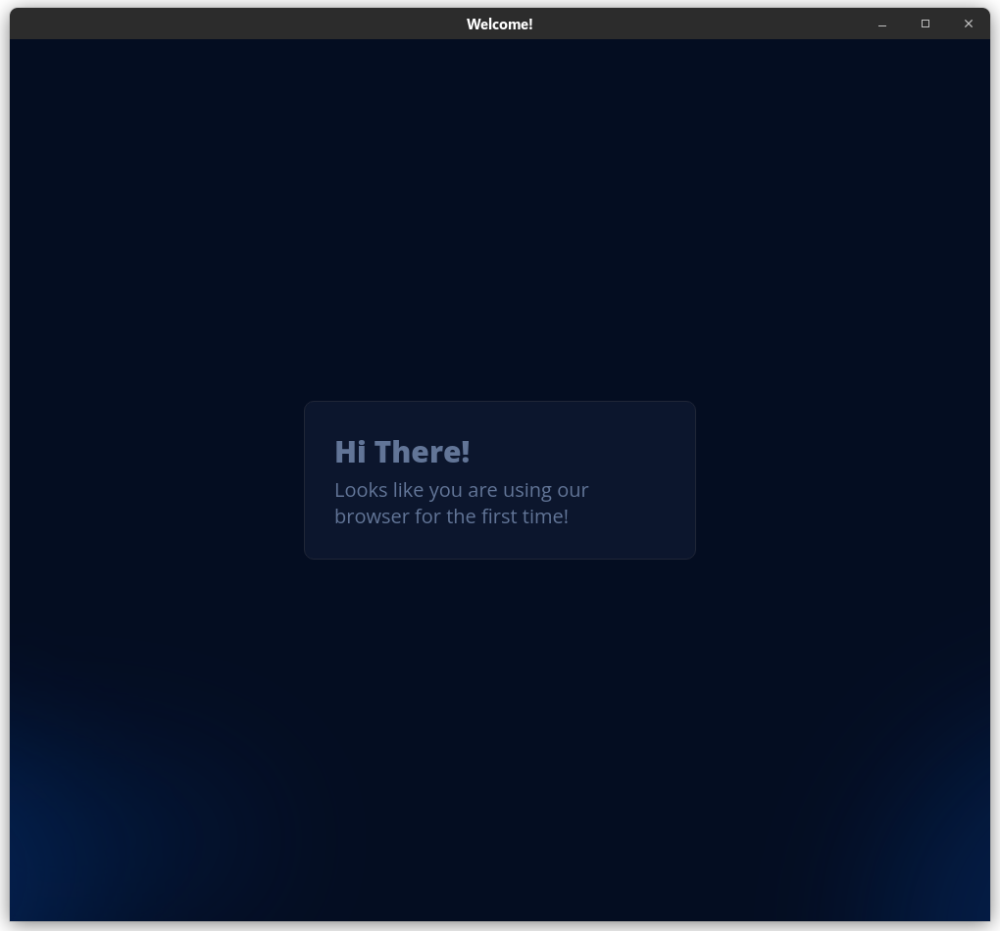
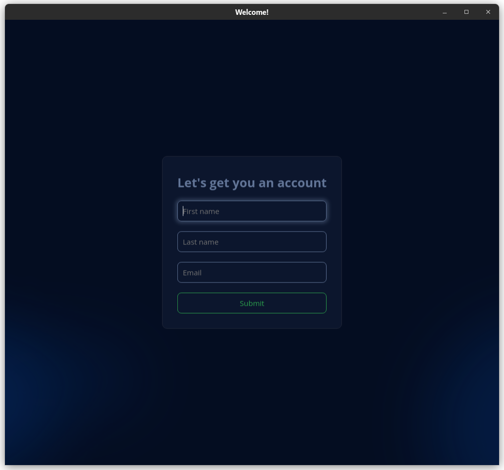
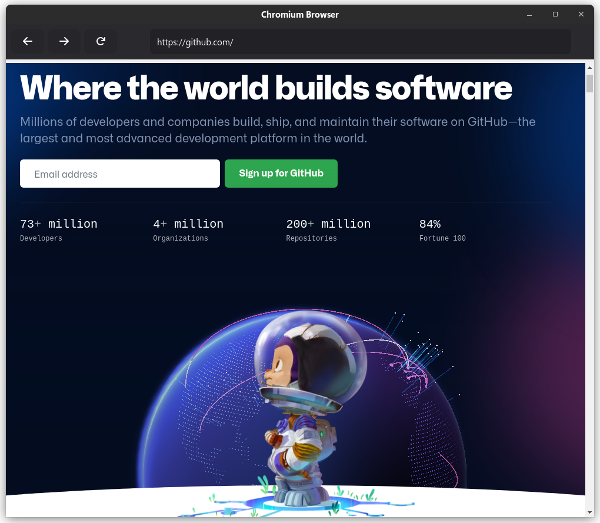
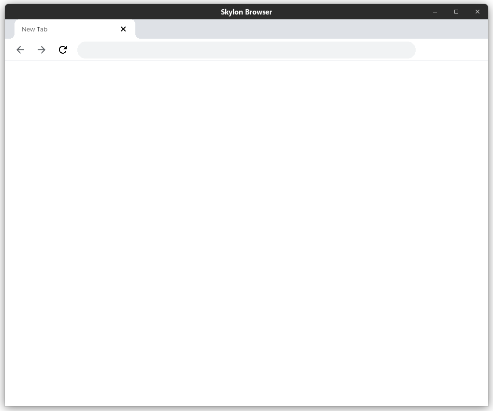

# SKYLON

This is my attempt at making a browser, which started with different motives but
now this is just a toy browser.

It features two engines:

- Chromium: to support, well, the entire web.
- Skylon: the toy engine I built.

To embed chromium [cefpython](https://github.com/cztomczak/cefpython) was used.

Since this is a school project and implementing data storage either via mysql or
pickle was a requirement, I have implemented a small user data section so that
it can store your engine preference.

### SCREENSHOTS

_Welcome Launcher_


_Welcome Launcher Sign Up/Login_


_Chromium_

_Skylon_


### CONTRIBUTE

To contribute to the skylon engine itself, create a pull request for the
[core](https://github.com/sujaldev/skylon/tree/core) branch.

### HOW TO RUN?

```shell
git clone https://github.com/sujaldev/skylon
cd skylon
pip install -r requirements.txt
python src/main.py
```

### SUPPORTED PLATFORMS

_NOTE: This project has cross-platform support but requires a bit of tweaking to
support platforms other than linux_

- [x] Linux
- [ ] Windows (requires minor changes)
- [ ] Mac (requires minor changes)

### Other linked repositories

- [skylon-core](https://github.com/sujaldev/skylon-core) <br>
  This repository contained the skylon engine, but now it <br>
  has shifted to the core branch of this repository itself<br> <br>
- [skylon-legacy](https://github.com/sujaldev/skylon-legacy) <br>
  This was my first attempt at creating a browser, <br>
  only to realise I am currently one stupid developer.